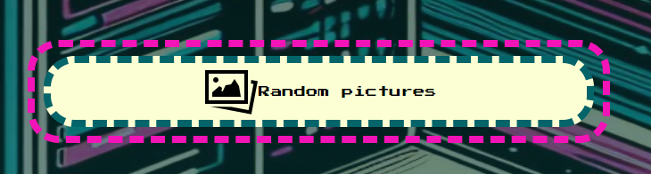
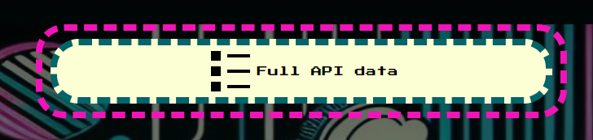
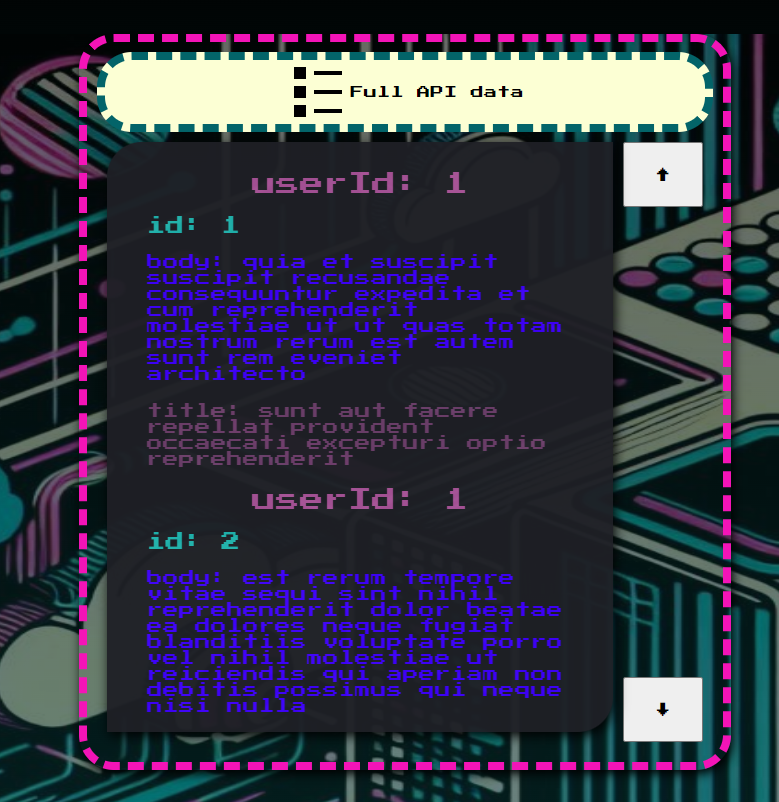
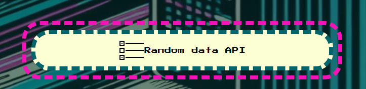
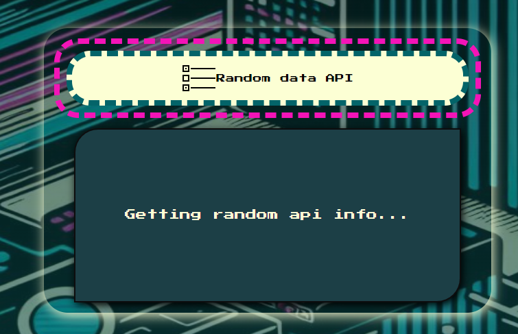
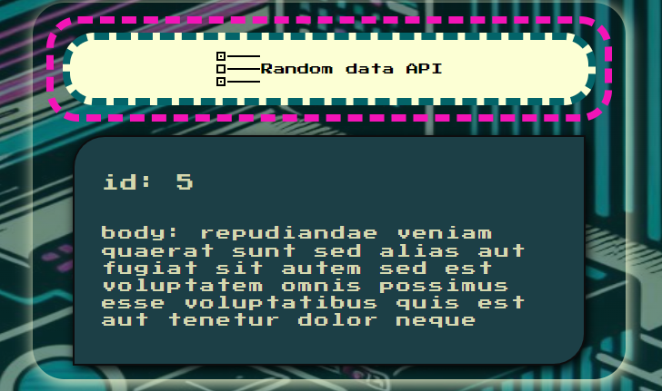
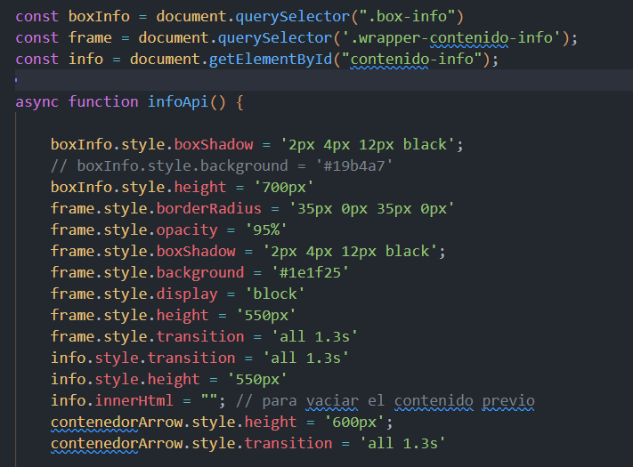
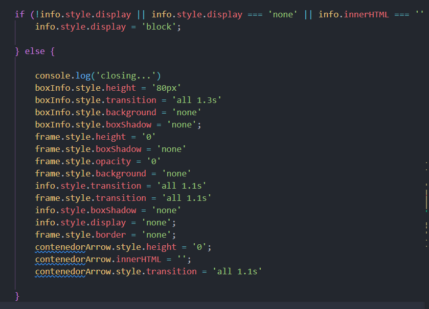

# Module 2: Case to solve

### Project description:

This is a brief explanation of my "MODULE 2: JavaScript" final project were try to show all the knowledge gained over the past weeks and some I learn while making this actual project. Note this project is not adjust for mobile or tablets, as it is mainly to show how I made different calls to the API placeholder provided by my tutor Daniel Ferrol.

In this project I have used javaScript on the explained points bellow:

- <u>To create logic to achieve the objectives bellow:</u>

  - A ` <button onclick="loadPhoto()">` <button>Random pictures</button> who shows 3 random pictures from a external source.

    

  - A `<button onclick="infoApi()">` <button>Full API data</button> who shows API full data.

    

    

  - A `<button onclick="randomInfo()">` <button>Random data API</button> who shows a random id and title from the API.

    

    
    

  - A `onchange="seleccion(event)"` <select><option >userId</option><option >id</option><option >title</option><option >body</option></select> with an event, which will show just the data from a specific attribute chosen.

- To refactor my own code;

  When I started to add lines to my script and create different functions to be able to show data from the API, I have noticed I was about to make the third call to the same API, hence I made a thought on how it could be minimized. So I learn the method [windows.onload=()=>{}](https://developer.mozilla.org/en-US/docs/Web/API/Window/load_event) which made possible to run the function callingApi() as the page loads. The function `callingApi()`, makes the call to the API and the value is given into an empty array named `data`. This makes it more functional to use in the rest of the function such as:

  - `async function infoApi()`
  - `function randomInfo()`
  - `function selector()`
  - `function seleccion(event)`

- DOM management

  - create elements
  - point at elements
  - give style to elements (even if it may be better option to do with CSS):

    With those styles bellow, I made possible to see the dropdown effect when the `<button onclick="infoApi()">` clicks.

    

    In addition, you could see the reversed effect as if the info would disappear when the `<button onclick="infoApi()">` clicks again.

    

- create new style to elements (even if as best practice would be best to create style with CCS, some of them are to be able to create the animation from the dropdown buttons)

### Sources:

[Random API url](https://jsonplaceholder.typicode.com/users/1/posts)

[Random photo API url](https://picsum.photos/150)

[Icons](https://iconos8.es/icons/set/list)

[Background-image](https://www.bing.com/chat?form=MW00X7&ef_id=_k_Cj0KCQjwsPCyBhD4ARIsAPaaRf0jCkl82lOmt4gdgvIQr2QJDo7tXDuU6GTIFsxb9PCCcAWung7GvS8aAk6uEALw_wcB_k_&OCID=AIDcmm9rh5zl23_SEM__k_Cj0KCQjwsPCyBhD4ARIsAPaaRf0jCkl82lOmt4gdgvIQr2QJDo7tXDuU6GTIFsxb9PCCcAWung7GvS8aAk6uEALw_wcB_k_&gad_source=1&gclid=Cj0KCQjwsPCyBhD4ARIsAPaaRf0jCkl82lOmt4gdgvIQr2QJDo7tXDuU6GTIFsxb9PCCcAWung7GvS8aAk6uEALw_wcB)

[Font](https://fonts.google.com/)
