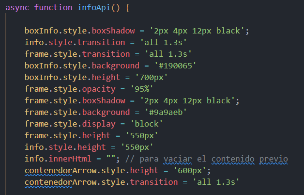
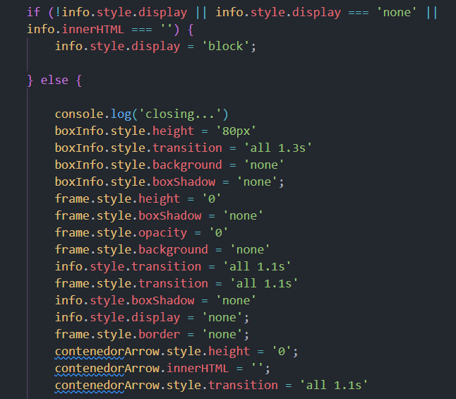

# Module 2: Case to solve

### Project description:

This is a brief explanation of my "MODULE 2: JavaScript" final project were try to show all the knowledge gained over the past weeks and some I learn while making this actual project. I have used javaScript:

- To create logic to achieve the objectives bellow:

  - A <button>Random pictures</button> who shown random pictures from a external source.
    ` <button onclick="loadPhoto()">`

  - A <button>Full API data</button> who shows API full data.
    `<button onclick="infoApi()">`

  - A <button>Random data API</button> who shows a random id and title from the API.
    `<button onclick="randomInfo()">`

  - A <select><option >userId</option><option >id</option><option >title</option><option >body</option></select> with an event, which will show just the data from a specific attribute chosen.
    `onchange="seleccion(event)"`

- To refactor my own code;
  When I started to add lines to my script and create different functions to be able to show data from the API, I have noticed I was about to make the third call to the API inside a function, hence I made a thought on how it could be minimized. So I learn the method [windows.onload=()=>{}](https://developer.mozilla.org/en-US/docs/Web/API/Window/load_event) which made possible to run the function callingApi() as the page loads. The function `callingApi()`, makes the call to the API and the value is given into an empty array named `data`. This makes it more functional to use in the rest of the function such as:

  - `async function infoApi()`
  - `function randomInfo()`
  - `function selector()`
  - `function seleccion(event)`

- DOM management

  - create elements
  - point at elements
  - give style to elements (even if it may be better option to do with CSS):

    With those styles bellow, I made possible to see the dropdown effect when the `<button onclick="infoApi()">` clicks.

    

    In addition, you could see the reversed effect as if the info would disappear when the `<button onclick="infoApi()">` clicks again.

    

  - create new style to elements (even if it may be better option to do with CSS)

### Sources:

[Random API url](https://jsonplaceholder.typicode.com/users/1/posts) : https://jsonplaceholder.typicode.com/users/1/posts

[Random photo API url](https://picsum.photos/200/300) : https://picsum.photos/200/300

[Icons](https://iconos8.es/icons/set/list) : https://iconos8.es/icons/set/list
